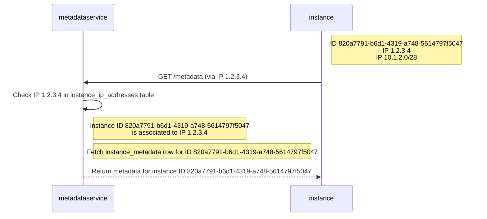
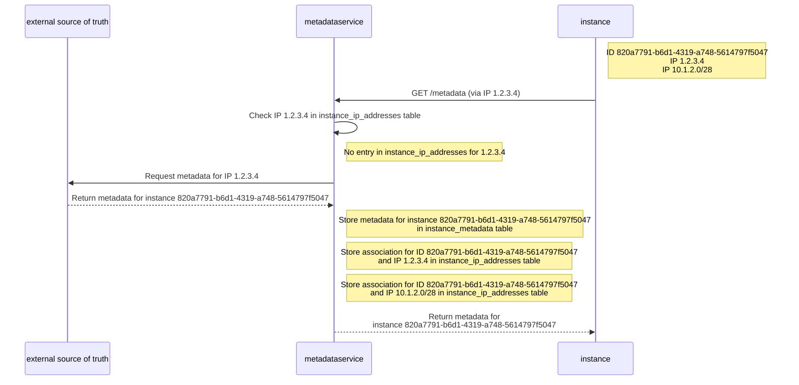
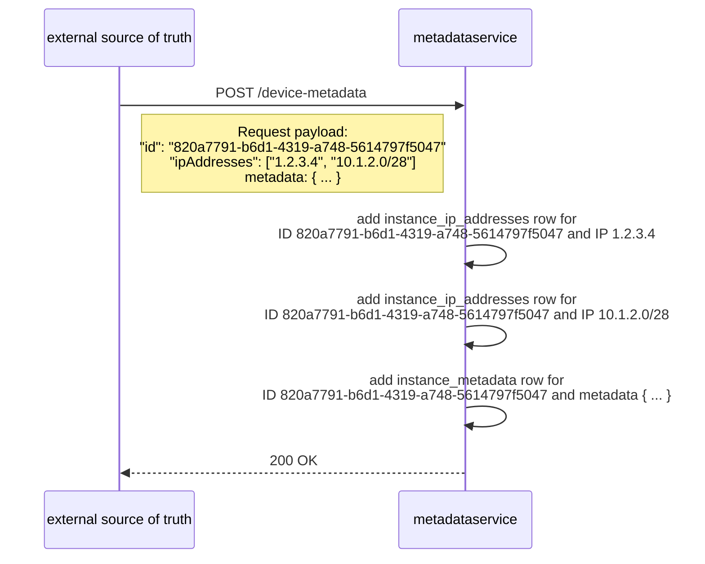
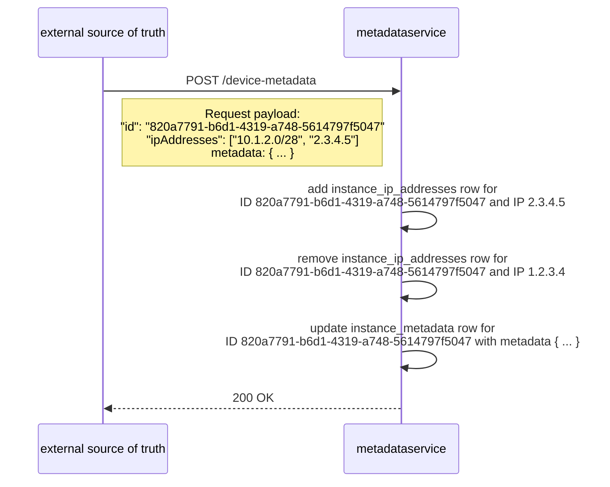
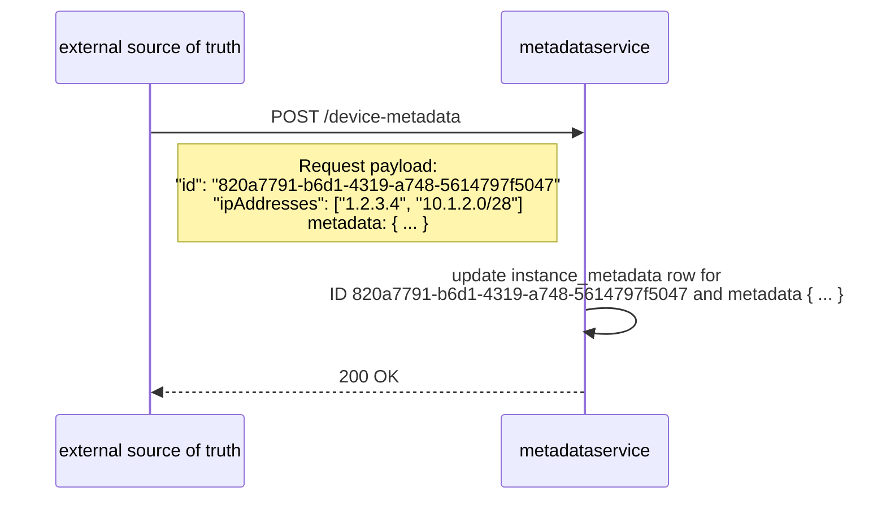
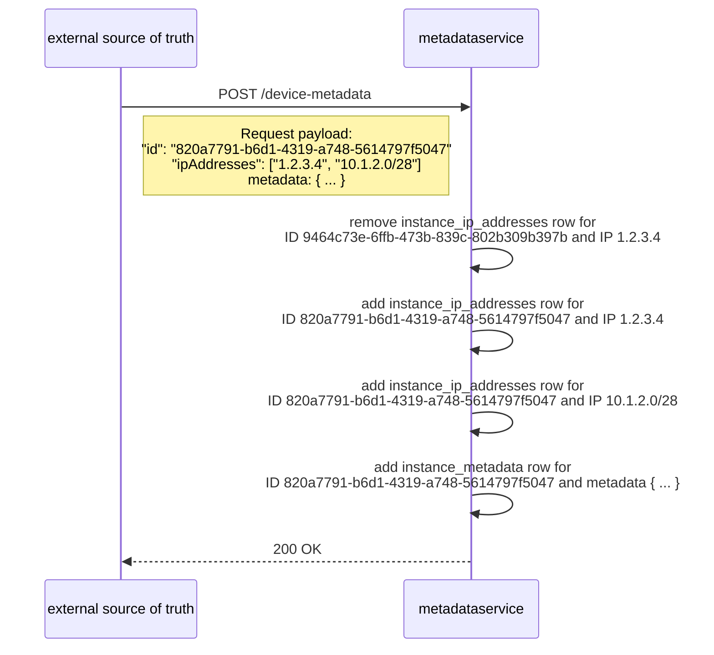
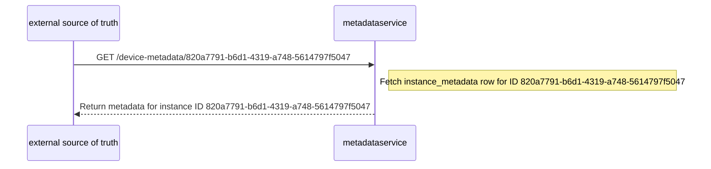

# hollow-metadataservice
A service for storing and retrieving instance metadata and userdata, brought to you by the Equinix Metal team.

## What is it?
When a new cloud instance is provisioned, often it will need additional information to fully bootstrap itself, beyond what may be specified in the OS image installed on the instance. A metadata service allows an instance to request some of that additional information without needing any pre-defined authentication information baked-in to the OS image.

Additionally, instance userdata can be used to specify simple scripts or cloud-init configurations that will run when the instance first boots after provisioning. Combined with instance metadata this offers a powerful mechanism to automate provisioning instances into a ready-to-use state, without needing to manually perform additional configuration tasks after the instance becomes active.

See [https://metal.equinix.com/developers/docs/server-metadata/metadata/](https://metal.equinix.com/developers/docs/server-metadata/metadata/) for more.

## How it Works
Any time after instance provisioning has begun, it can issue a request to retrieve its' own metadata or userdata. On Equinix Metal, this information is available at `https://metadata.platformequinix.com/metadata`. The service identifies the instance making the request by examining the request IP address -- meaning that an instance can only retrieve *its' own* metadata or userdata. Metadata and userdata are considered to be private to each instance, so it's not possible for one instance to request the metadata associated to a different instance.

**Note** While the service will only return metadata for the instance making the request, there's no authentication mechanism required. That means that **any** program running on that instance is capable of viewing that instances' metadata and userdata. So it's still important to keep sensitive information out of your userdata.

## Metadata Format
The service offers two "flavors" of metadata -- a standard JSON format, and an "ec2-style" format.

### Standard JSON Format
The standard JSON metadata format may include (but is not limited to) the following fields:
- `id` - (uuid) The unique ID of the instance.
- `hostname` - (string) The hostname of the instance.
- `operating_system` - (object) A JSON object containing information about the OS installed on the instance.
    - `slug` - (string) A string typically containing a concatenated version of the OS name and version.
    - `distro` - (string) The OS name or distro
    - `version` - (string) The version of the OS
- `plan` - (string) The name of the hardware plan for the server on which the instance is provisioned. Example: `"c3.medium.x86"`
- `class` - (string) A slug-formatted version of the hardware plan.
- `facility` - (string) The facility code of the location in which the instance has been provisioned.
- `tags` - (array) A list of strings that were specified when the instance was provisioned. Typically set by users for grouping instances or hinting at their expected roles. Example: `["worker"]`
- `ssh_keys` - (array) A list of the SSH public keys allowed to access the instance.
- `specs` - (object) A JSON object containing information about the server's hardware specs, such as CPUs, RAM, disks, network interfaces, and additional features enabled for the server.
    - `cpus` - (array) A list of JSON objects with processor types and counts.
    - `memory` - (object) A JSON object with the instances' total memory.
    - `drives` - (array) A list of JSON objects describing the type disk sizes, types, and categories.
- `storage` - (object) A JSON object containing extended information about the disks partitions and filesystems created during the OS install process.
- `network` - (object) A JSON object containing extended information about the network interfaces, such as bonding mode, LACP bond names, and IP addresses.
    - `bonding` - (object) A JSON object containing information about the network bond configuration for the instance.
    - `interfaces` - (array) A list of JSON objects containing information about the individual network interfaces on the instance, such as MAC addresses and bond.
    - `addresses` - (array) A list of JSON objects containing information about the IP addresses assigned to the instance, like address, address family, and whether the address is public or private.
- `spot` - (object) A JSON object containing spot market-related information (if instance was provisioned as a spot market instance)
    - `termination_time` - (string) A timestamp indicating the termination time for the instance.

Not all fields are required (for example, the metadata JSON for aa non-spot market instance will not include the `spot` field), and additional fields may be specified as needed.

#### An Example Metadata JSON object
The following is an example of the Metadata JSON returned for an Equinix Metal instance.
```
{
  "id": "cc40301c-4038-4011-af55-6eae3ba60246",
  "hostname": "metadata-example-01",
  "iqn": "iqn.2022-02.net.packet:device.cc40301c",
  "operating_system": {
    "slug": "ubuntu_20_04",
    "distro": "ubuntu",
    "version": "20.04",
    "license_activation": {
      "state": "unlicensed"
    },
    "image_tag": "31853a2b0b2fcc4ee7fd5da5e53611303b60aafa"
  },
  "plan": "c3.medium.x86",
  "reserved": false,
  "class": "c3.medium.x86",
  "facility": "da11",
  "metro": "da",
  "private_subnets": [
    "10.0.0.0/8"
  ],
  "tags": [],
  "ssh_keys": [
    ssh-ed25519 AAAAC3NzaC1lZDI1NTE5AAAAIDtmDuGK3tzmR4o/7QENvMOitBvsO8uN4Z1WblfVWyAg test@testmachine.local
    ssh-rsa AAAAB3NzaC1yc2EAAAADAQABAAACAQDYgqt+YAYiF0v3PohhkqR3rCul3TaksPbYE+e0VyGXE7C/bjBKDCBqrjN1MmbwFzatY7KLXzin5tFJCcuyDwAh3poSI57YYufYQAfBhG3u8Z++Q4RHdgjrSY0OspQR0dEHfK64FQ/6jbbtfWat09KN9F9Gay5BHl93B+OOb0qVq7Pf9Z7hC0OeMDsEtx6jhZmDeWfAPfLPVkk2bVaORFwFuF3cbNT3CtTAXaHTl4JWpL98ZVYFNm35s0x+eFbG5hyU9OW9MgOU3a21SKiGFt0673iQpwCC5jO1hyUVAsQdP1qRC2DbYhO0elVJ11GeXgz/BospqI+vmdEBRbo/vv6NVspxhOgyy+LpUDVSqX9FN0wWAtWoKN4WliEohCibuFNlIRUlfd9ZEvTCMZFE+xbwewCZwmXT0aThbRLZleMjGGR5HDEv3YAYGm7XplaQH+XiTS9t2J2GQiCltlbTft/yUxMUs2Iq1iGn7RigMyaBvHdTFQW/l0Mqihip/0zT/7BtNu9A6OohWWl9Vv8cQZurUwt7pQ9L5XvtMTqpAJqTsacUsu1H2kERZ8PiUjfvYWjrM++PJu5OvkodpawxN4KRX63oso2PPbfo105BsMmmstTaIusp+2LBqzDMTQee9wdfMc2po8TEOHSnEsmAnnG8AGSMnSWODchJEPiFXtiaDw== test@testmachine.local
  ],
  "customdata": {},
  "specs": {
    "cpus": [
      {
        "count": 1,
        "type": "AMD EPYC 7402P 24-Core Processor"
      }
    ],
    "memory": {
      "total": "64GB"
    },
    "drives": [
      {
        "count": 2,
        "size": "240GB",
        "type": "SSD",
        "category": "boot"
      },
      {
        "count": 2,
        "size": "480GB",
        "type": "SSD",
        "category": "storage"
      }
    ],
    "nics": [
      {
        "count": 2,
        "type": "10Gbps"
      }
    ],
    "features": {
      "raid": true,
      "txt": true,
      "uefi": false
    }
  },
  "switch_short_id": "5707e61f",
  "storage_source": "default",
  "storage": {
    "disks": [
      {
        "device": "/dev/sda",
        "wipeTable": true,
        "partitions": [
          {
            "label": "BIOS",
            "number": 1,
            "size": 4096
          },
          {
            "label": "SWAP",
            "number": 2,
            "size": "3993600"
          },
          {
            "label": "ROOT",
            "number": 3,
            "size": 0
          }
        ]
      }
    ],
    "filesystems": [
      {
        "mount": {
          "device": "/dev/sda3",
          "format": "ext4",
          "point": "/",
          "create": {
            "options": [
              "-L",
              "ROOT"
            ]
          }
        }
      },
      {
        "mount": {
          "device": "/dev/sda2",
          "format": "swap",
          "point": "none",
          "create": {
            "options": [
              "-L",
              "SWAP"
            ]
          }
        }
      }
    ]
  },
  "volumes": [],
  "boot_drive_hint": "MTFDDAV240TDU",
  "network": {
    "bonding": {
      "mode": 4,
      "link_aggregation": "mlag_ha",
      "mac": "40:a6:b7:74:9f:10"
    },
    "interfaces": [
      {
        "name": "eth0",
        "mac": "40:a6:b7:74:9f:10",
        "bond": "bond0"
      },
      {
        "name": "eth1",
        "mac": "40:a6:b7:74:9f:11",
        "bond": "bond0"
      }
    ],
    "addresses": [
      {
        "id": "b9c60623-78e0-4010-91ee-f29b23579170",
        "address_family": 4,
        "netmask": "255.255.255.254",
        "created_at": "2022-02-25T18:55:11Z",
        "public": true,
        "cidr": 31,
        "management": true,
        "enabled": true,
        "network": "40.91.78.228",
        "address": "40.91.78.229",
        "gateway": "40.91.78.228",
        "parent_block": {
          "network": "40.91.78.228",
          "netmask": "255.255.255.254",
          "cidr": 31,
          "href": "/ips/b9c60623-78e0-4010-91ee-f29b23579170"
        }
      },
      {
        "id": "8ef53fd6-cc38-41a3-9a44-847fe85d0e73",
        "address_family": 6,
        "netmask": "ffff:ffff:ffff:ffff:ffff:ffff:ffff:fffe",
        "created_at": "2022-02-25T18:55:11Z",
        "public": true,
        "cidr": 127,
        "management": true,
        "enabled": true,
        "network": "2001:0db8:8583:0000::8",
        "address": "2001:0db8:8583:0000::9",
        "gateway": "2001:0db8:8583:0000::8",
        "parent_block": {
          "network": "2001:0db8:8583:0000:0000:0000:0000:0000",
          "netmask": "ffff:ffff:ffff:ff00:0000:0000:0000:0000",
          "cidr": 56,
          "href": "/ips/8ef53fd6-cc38-41a3-9a44-847fe85d0e73"
        }
      },
      {
        "id": "c12967eb-fec9-4dd6-b6f2-2fedb938cbdc",
        "address_family": 4,
        "netmask": "255.255.255.254",
        "created_at": "2022-02-25T18:55:11Z",
        "public": false,
        "cidr": 31,
        "management": true,
        "enabled": true,
        "network": "10.70.17.8",
        "address": "10.70.17.9",
        "gateway": "10.70.17.8",
        "parent_block": {
          "network": "10.70.17.0",
          "netmask": "255.255.255.128",
          "cidr": 25,
          "href": "/ips/c12967eb-fec9-4dd6-b6f2-2fedb938cbdc"
        }
      }
    ],
    "metal_gateways": []
  },
  "api_url": "https://metadata.platformequinix.com",
  "phone_home_url": "http://tinkerbell.da11.packet.net/phone-home",
  "user_state_url": "http://tinkerbell.da11.packet.net/events"
}
```

### EC2-Style
The EC2-Style format for metadata is meant to make the instance metadata easily consumable by tooling that might be hardcoded to use EC2-style metadata. The service translates the fields present in the Metadata JSON record to return the values in this format. The following fields are supported by the EC2-style format:
- `instance-id`
- `hostname`
- `iqn`
- `plan`
- `facility`
- `tags`
- `operating-system`
- `public-keys`
- `spot`
- `local-ipv4`
- `public-ipv4`
- `public-ipv6`

All responses are returned with a `Content-Type` of `text/plain`.

An instance issuing a request to `https://metadata.platformequinix.com/2009-04-04/meta-data` will receive a list of metadata categories applicable for the instance. That is, the `public-ipv6` category will only be listed if the instance has an associated IPv6 address.

## Creating / Updating / Deleting Metadata and Userdata
### Creating a Metadata Record
To store metadata for an instance, an external system should issue an authenticated `POST` request to the `/device-metadata` endpoint. An example request payload is:

```
{
  "id": "67fe638b-87b3-4fde-b191-1effb94b3c19",
  "ipAddresses": ["10.1.2.0/28", "139.73.254.254", "2001:0db8:8583::9"],
  "metadata": {
    "id": "67fe638b-87b3-4fde-b191-1effb94b3c19",
    "hostname": "instance-metadata-example-01",
    ... snipped for brevity
  }
}
```

### Updating a Metadata Record
To update the metadata for an instance, or to change the IP addresses associated to the instance, the same request can be issued, with the `ipAddresses` and/or `metadata` fields updated with the new instance IPs and metadata. It is important to note that a full request payload must be sent each time, no partial updates or json patch-style updates are supported at this time.

### Removing a Metadata Record
To delete the metadata associated to an instance, issue an authenticated `DELETE` request to `/device-metadata/:instance-id`.

### Creating a Userdata Record
To store userdata for an instance, an exetnal system should issue an authenticated `POST` request to the `/device-userdata` endpoint. An example request payload is:

```
{
  "id": "67fe638b-87b3-4fde-b191-1effb94b3c19",
  "ipAddresses": ["10.1.2.0/28", "139.73.254.254", "2001:0db8:8583::9"],
  "userdata": "#cloud-config\npackage_upgrade: true\npackages:\n    - nginx\n"
}
```

### Updating a Userdata Record
To update the userdata for an instance, or to change the IP addresses associated to the instance, the same request can be issued with the `ipAddresses` and/or `userdata` fields updated with the new instance IPs and userdata. It is important to note that a full request payload must be sent each time, no partial updates or json patch-style updates are supported at this time.

### Removing a Userdata Record
To delete the userdata associated to an instance, issue an authenticated `DELETE` request to `/device-userdata/:instance-id`.

## Dealing with Conflicts
Because IP addresses tend to be a shared and reusable resource, it's possible for the metadata service and the external source-of-truth to become out-of-sync. For example, if the external system fails to `DELETE` the metadata associated to an instance while deprovisioning the instance, and then proceeds to re-issue the deprovisioned instances' IP addresses to a new instance.

To address this, the service has a couple requirements:
1. All IP addresses associated to an instance must always be specified any time metadata or userdata records are created or updated for an instance.
2. For the association between an instance and an IP address, the last write will always win.

This means that if a metadata record is created for an instance ID `87303132-096a-48ee-b3ad-359bf4f08c60` with IP Addresses 1.2.3.4 and 10.1.2.0/28, and a subsequent update request is sent, but only IP 10.1.2.0/28 is included in the `ipAddresses` field of the request payload, IP 1.2.3.4 will be dissociated from the instance.

Additionally, if a new request for a different instance ID is received, but it includes an IP address that's already associated to another instance, that IP address will be dissociated from the previous instance and associated to the instance ID specified in the request.

## Fetching Data from an Upstream Source of Truth
If the external source of truth has not sent a `POST` request to create a metadata or userdata record for an instance IP address, the service can optionally try to fetch the data from an external system when a request for metadata is received from the instance. The response will then be cached by the service and served up for any subsequent requests made by the instance. See the section on [configuring an external source of truth](#configuring-an-external-source-of-truth) for more information.

## Some Diagrams

### Handling Requests from Instances
#### Metadata or userdata request when the instance IP is known and the data has already been stored by the service



#### Metadata or userdata request when the instance IP is not known



### Handling Create / Update / Delete Requests from an External System
#### Creating the initial metadata record for an instance



#### Creating the initial userdata record for an instance


#### Updating the IP addresses associated to an instance
*Note* Metadata flow is shown, similar updates occur with requests to `device-userdata`

In the following diagram, assume the service already has metadata for instance ID `820a7791-b6d1-4319-a748-5614797f5047` and IP addresses `1.2.3.4` and `10.1.2.0/28`.
This flow demonstrates that a newly-associated IP address, `2.3.4.5` is added for the instance, while the association for an old IP, `1.2.3.4`, is removed, as it was not specified in the new request.


#### Updating the metadata associated to an instance
The following diagram demonstrates a request where matching IP addresses are included in the payload, but an update metadata record is sent. Only the metadata record will be changed by this request.



#### Creating a new metadata record for an instance when one or more of the IP addresses is already associated to a different instance
This flow illustrates how the service handles IP address conflicts. That is, when a request comes in specifying an IP address that is already associated to a different instance ID. When that occurs, the `instance_ip_addresses` row for the "old" instance ID and IP address is removed. For this flow, assume that IP address `1.2.3.4` is already associated to a different instance, ID `9464c73e-6ffb-473b-839c-802b309b397b`.


#### Retrieving the cached metadata record for an instance
This flow demonstrates the endpoint allowing for an authenticated external system to view the metadata or userdata records already stored in the service. This can be useful if the external system wants to verify that create / update requests were processed successfully.



## Configuring an external source of truth

To successfully use the metadata service, all that is needed is an external system capable of "pushing" updates (in the form of `POST`s and `DELETE`s) to the service. However, it is also possible that you might want to operate the service in a "pull"-oriented style, where data is only added to the metadata service on-demand. To facilitate this, the metadata service can also call out to the external source of truth when processing a request made by an instance, and the service does not already have data for that instance stored locally. See the diagram for [Metadata or userdata request when the instance IP is not known](#metadata-or-userdata-request-when-the-instance-ip-is-not-known) for a visualization.

This upstream service should expose a couple of HTTP endpoints to support this flow:

- `GET /device-metadata/:instance-id`
- `GET /device-metadata?ip_address=[the requesting instance's IP]`
- `GET /device-userdata/:instance-id`
- `GET /device-userdata?ip_address=[the requesting instance's IP]`

This lookup functionality is disabled by default, but can be enabled by setting the `--lookup-enabled` and `--lookup-base-url` flags (or via the `METADATASERVICE_LOOKUP_ENABLED` and `METADATASERVICE_LOOKUP_BASEURL` enviroment variables).

Additional flags and environment variables for controlling authentication via Oauth can be found in [cmd/serve.go](cmd/serve.go) under "Lookup Service Flags".


### Creating database migrations
`goose -dir db/migrations -s [migration_name] sql`
